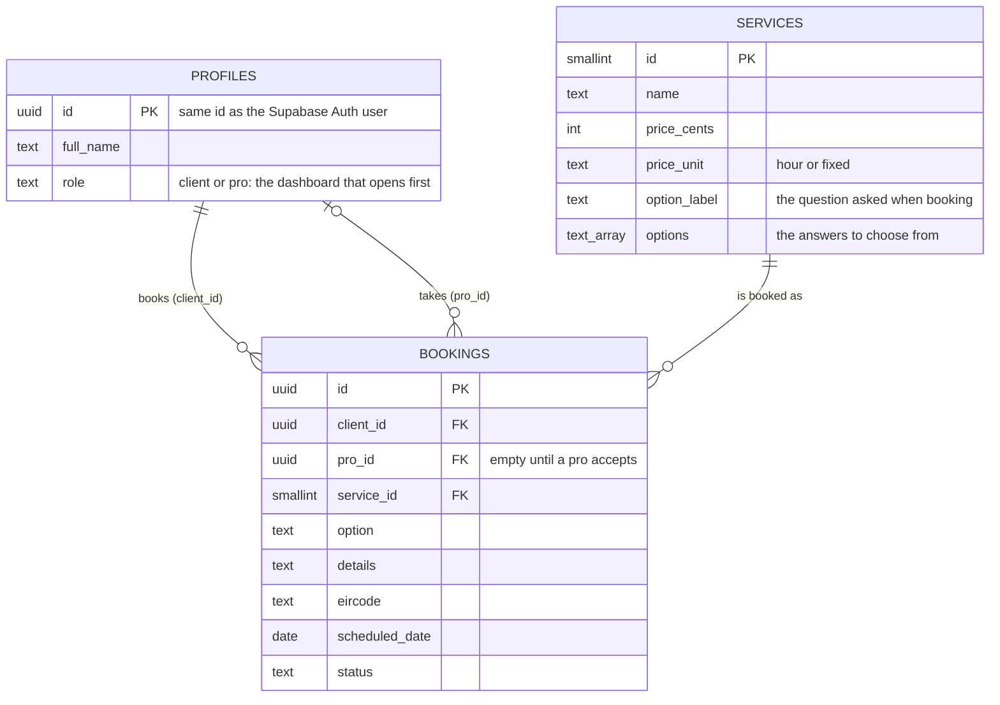
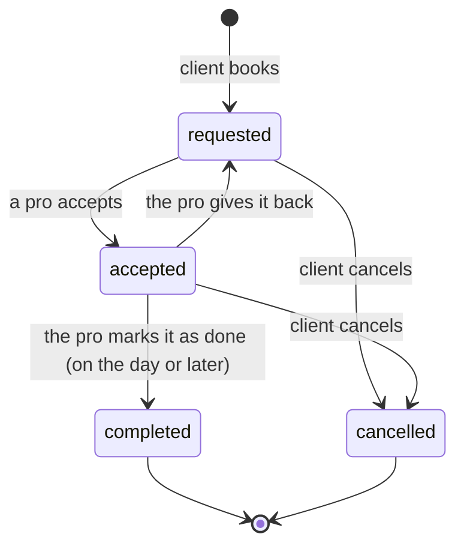

# Habitick

A marketplace for everyday home services in Ireland: cleaning, gardening, dog walking,
repairs and more. A client picks a service and says when and where; a professional
accepts the job, does it, and marks it as done.

It is a portfolio project. The services and prices are examples and no real bookings
are fulfilled.

## What it does

**As a client**

- Browse nine services with prices, loaded from the database.
- Create an account and book a service for a date and an Eircode.
- Follow each booking: waiting for a pro, confirmed (with the pro's name), done.
- Cancel a booking until the job is done.

**As a professional**

- See the open requests. Only the area (the first half of the Eircode) is shown.
- Accept a job. The client's name and full Eircode appear only after that.
- Mark the job as done on the day, or give it back so someone else can take it.

One account can do both; a button in the dashboard switches between the two modes.

## How it is built

| Layer | What is used | Where to look |
| --- | --- | --- |
| Interface | React 19, React Router, Tailwind CSS | `src/pages`, `src/components` |
| Logic | The booking rules, written once in JavaScript for the screen and once in SQL where they are enforced | `src/lib/booking.js`, `supabase/schema.sql` |
| Data | PostgreSQL on Supabase: three tables, a view, Row Level Security | `supabase/schema.sql` |
| Delivery | Vite build, GitHub Actions (lint, tests, build), Vercel hosting | `.github/workflows/ci.yml`, `vercel.json` |

Accounts (sign-up, login, sessions) are handled by Supabase Auth.

### The data



### The life of a booking



Each arrow is one database function (`create_booking`, `accept_booking`,
`release_booking`, `complete_booking`, `cancel_booking`). Nobody can write to the
`bookings` table directly, so the rules cannot be skipped from the browser. If two
pros accept the same job at the same moment, only one succeeds and the other is told
the job is no longer available.

### Who can see what

| | Visitor | Client | Pro, before accepting | Pro, after accepting |
| --- | --- | --- | --- | --- |
| Services and prices | yes | yes | yes | yes |
| A booking | no | their own | service, date, notes, area | everything |
| Full Eircode | no | their own | no | yes |
| The other person's name | no | once a pro accepts | no | yes |

An Eircode identifies one exact address, which is why it stays hidden until a pro has
committed to the job.

## Run it on your computer

You need Node.js 22 or newer and a free [Supabase](https://supabase.com) project.

1. Install the packages:

   ```bash
   npm install
   ```

2. Create the database. In the Supabase dashboard open **SQL Editor**, paste the whole
   of `supabase/schema.sql` and press **Run**. It can be run again at any time.

3. Tell the app where the project is. Copy `.env.example` to `.env.local` and fill in
   the two values from the API settings of your Supabase project.

4. Start it:

   ```bash
   npm run dev
   ```

By default Supabase asks new users to confirm their email before they can log in.
For a demo it is easier to switch that off: in the Authentication settings, open the
Email provider and turn off **Confirm email**.

## Tests

```bash
npm test
```

- `tests/booking.test.js` checks the rules in JavaScript: Eircodes, dates, and who may
  cancel, give back or finish a booking.
- `tests/database.test.js` loads `supabase/schema.sql` into a Postgres that runs in
  memory and checks the rules where they are enforced: what each person can read, that
  bookings cannot be written directly, and every step in the life of a booking.

The same tests, the linter and a production build run on GitHub for every push
(`.github/workflows/ci.yml`).

## Put it online (Vercel)

1. Push the repository to GitHub.
2. On [vercel.com](https://vercel.com), choose **Add New > Project** and import the
   repository. Vercel recognises Vite; leave the build settings as they are.
3. Under **Environment Variables**, add `VITE_SUPABASE_URL` and
   `VITE_SUPABASE_PUBLISHABLE_KEY` with the same values as in `.env.local`.
4. Deploy.
5. In Supabase, in the Authentication settings under URL Configuration, set **Site URL**
   to the address Vercel gave you, so the links in confirmation emails point to the live site.

`vercel.json` sends every address to `index.html`, so opening `/dashboard` directly works.

## Where things are

```
supabase/schema.sql      the whole database: tables, access rules, functions, services
src/
  main.jsx               starts the app
  App.jsx                session, messages, opening animation, routes
  supabaseClient.js      the connection to Supabase
  lib/
    api.js               every call to the backend
    booking.js           the Booking class and the form checks
    format.js            prices, dates and names as text
  pages/
    Home.jsx             the public page with the services
    Dashboard.jsx        the private area, in client or pro mode
  components/            the booking form, the login window, the lists and cards
tests/                   the automated tests
```

## Not built yet

- Payments. The "Premium" screen shows a price, but nothing is charged.
- Email or push notifications when a booking changes; the lists refresh when the
  window gets focus and with the Refresh button.
- Reviews and ratings.
- Matching by distance. Every pro sees every open request.
