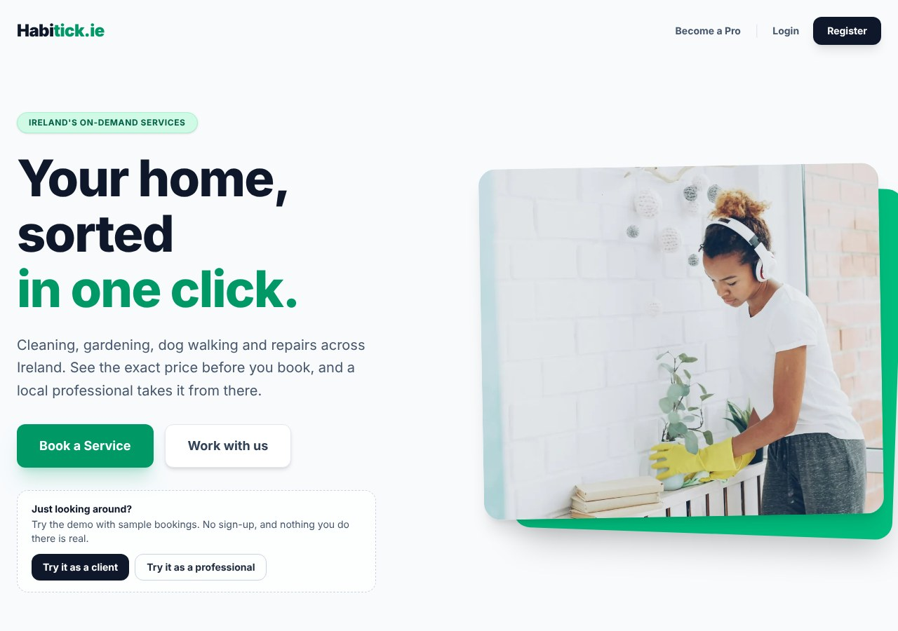
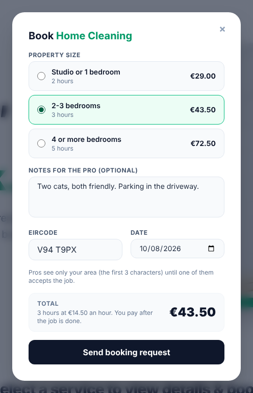
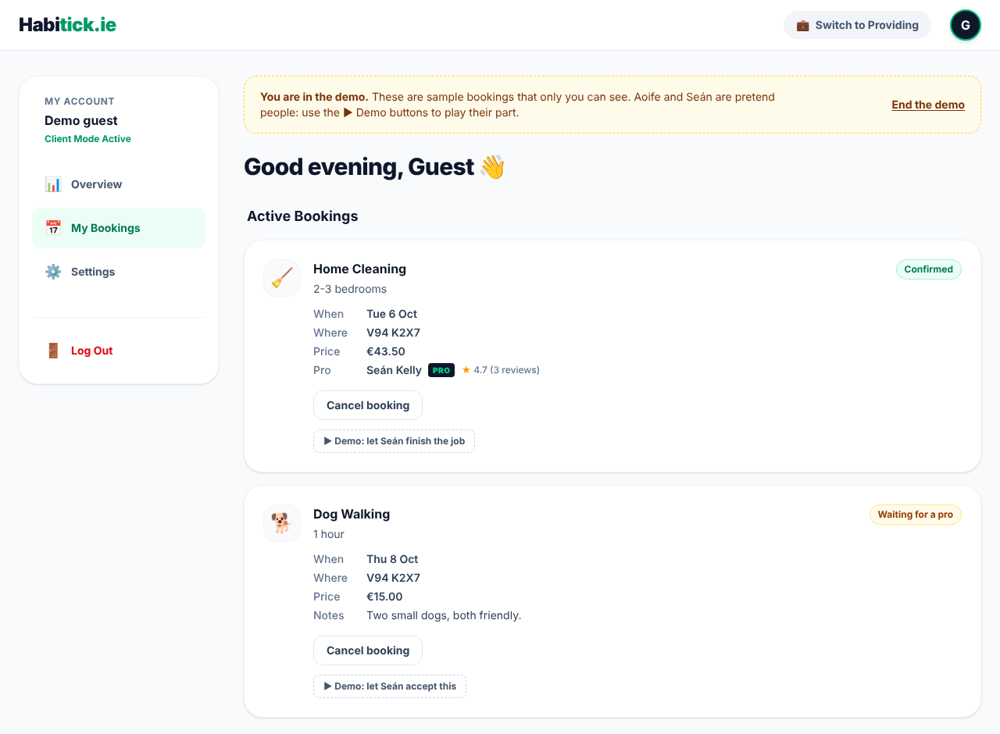
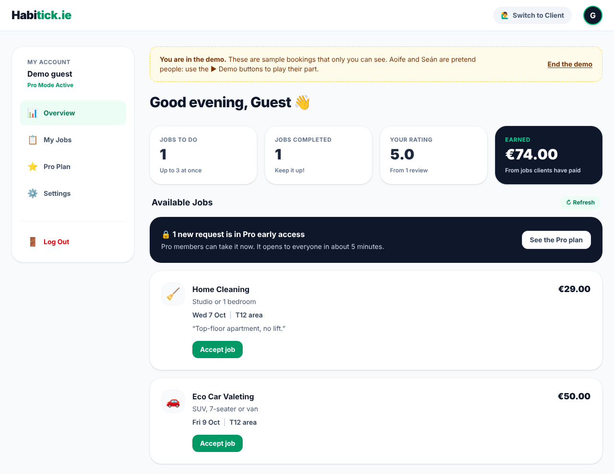
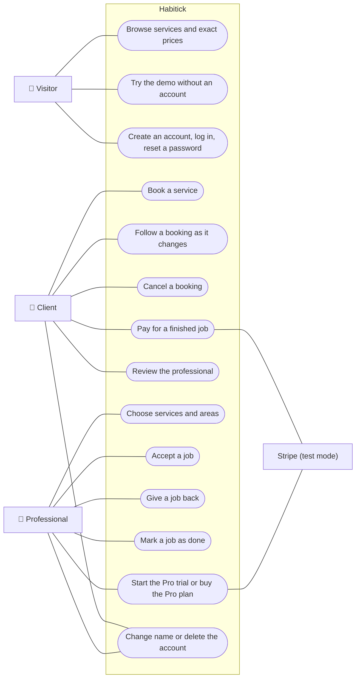
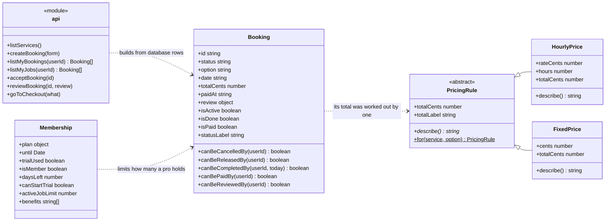
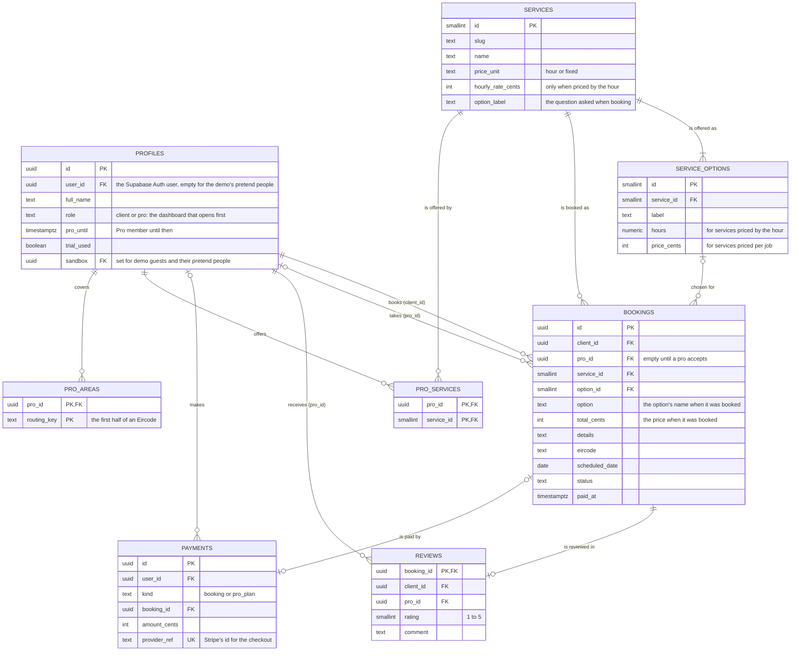
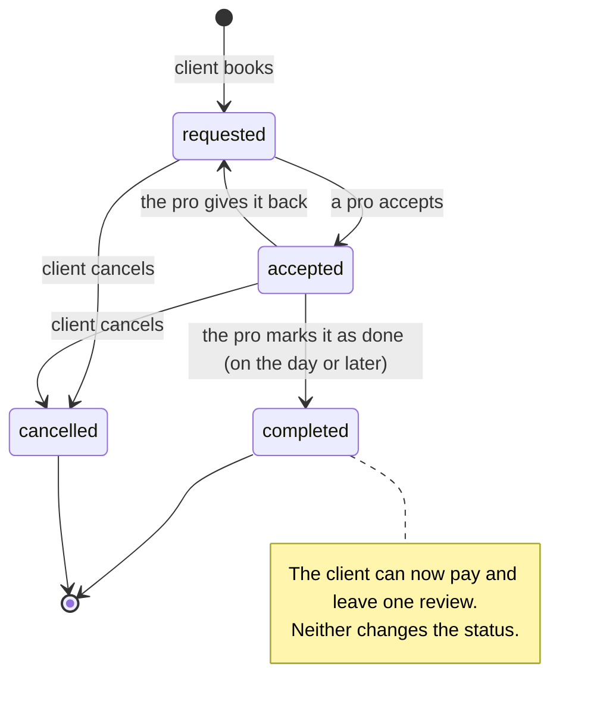
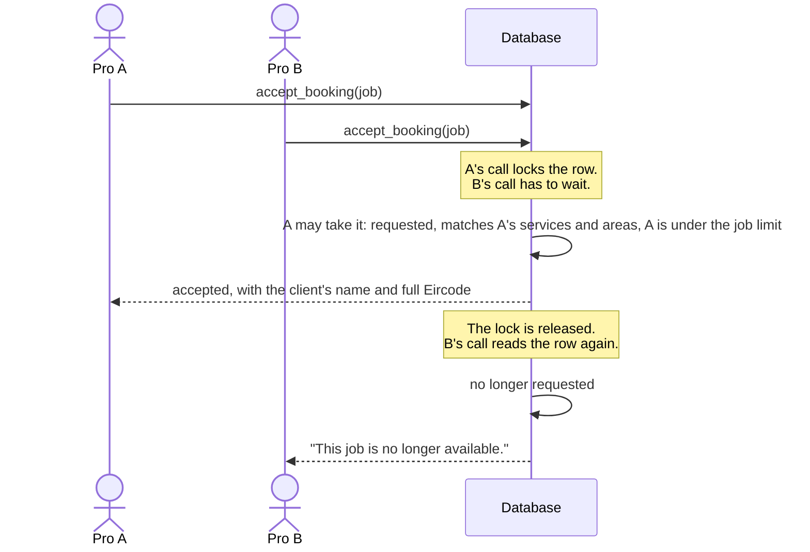
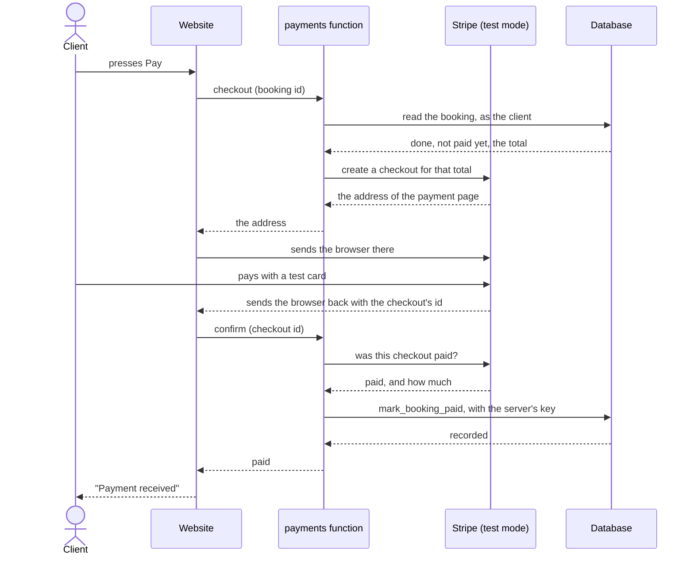

# Habitick

A marketplace for everyday home services in Ireland: cleaning, gardening, dog walking,
repairs and more. A client picks a service and says when and where; a professional
accepts the job, does it, and marks it as done; the client pays and leaves a review.

It is a portfolio project. The services and prices are examples, no real bookings are
fulfilled, and payments run in Stripe's test mode only, so no real money can move.



| Booking, with the exact price | The client's bookings | The professional's dashboard |
| --- | --- | --- |
|  |  |  |

The two dashboards are shown in the demo, which anyone can open from the home page
without an account.

## Contents

- [The idea](#the-idea)
- [What it does](#what-it-does)
- [How it is built](#how-it-is-built)
- [The design in diagrams](#the-design-in-diagrams)
- [Who can see what](#who-can-see-what)
- [Run it on your computer](#run-it-on-your-computer)
- [Switch on the optional parts](#switch-on-the-optional-parts)
- [Tests](#tests)
- [Put it online (Vercel)](#put-it-online-vercel)
- [Where things are](#where-things-are)
- [Decisions and limits](#decisions-and-limits)
- [Ideas for what comes next](#ideas-for-what-comes-next)

## The idea

Ordering a taxi or a takeaway takes a minute on a phone. Finding someone to cut the
grass, clean the house or walk the dog still usually means asking around, ringing
numbers and waiting for a call back. Habitick treats those everyday jobs like a ride:
choose the service, say when and where, and the first available professional takes it.

### How similar products work

The same idea exists in other countries, and the products differ mainly in two things:
how a job finds a professional, and who pays the platform.

| Product | Where | How a job finds a pro | Who pays the platform |
| --- | --- | --- | --- |
| [TaskRabbit](https://www.taskrabbit.com) | US, UK and others | The client chooses a Tasker from a list | The client, as a service fee on top of the Tasker's rate |
| [Airtasker](https://www.airtasker.com) | Australia, UK | The client posts a task, pros make offers, the client picks one | The pro, as a share of the task price that is smaller for pros on a higher tier |
| [GetNinjas](https://www.getninjas.com.br) | Brazil | The client posts a request and a few pros pay to see the contact | The pro, who buys coins to unlock requests; there is no commission |
| [Urban Company](https://www.urbancompany.com) | India, UAE, Singapore | The app matches the job to a vetted pro automatically | The pro, as a commission on each job |
| **Habitick** | Ireland | The first pro who accepts gets the job | The pro, and only if they want to: a flat monthly Pro plan, no commission |

Habitick is closest to Urban Company in how a job is given out: there is no bidding and
no browsing of profiles. It differs in two ways. A pro sees only the area of a job until
they commit to it (see [Who can see what](#who-can-see-what)), and the platform earns
from an optional plan with real benefits instead of taking a cut of every job.

## What it does

**As a client**

- Browse nine services. Every option has an exact price, so the total is known before
  booking: an hourly rate times the hours the option takes, or a fixed price for the job.
- Book a service for a date and an Eircode, with notes for the professional.
- Follow each booking as it changes, without reloading the page: waiting for a pro,
  confirmed, done.
- See who is coming once a pro accepts: their name, their rating, how many reviews it
  is based on, and a PRO badge if they are a member.
- Cancel a booking until the job is done.
- Pay for a finished job on Stripe's checkout page (test mode).
- Review the professional once the job is done: one to five stars and a comment.

**As a professional**

- Choose which services you offer and which areas you cover. Only matching requests
  are shown.
- See the open requests with the price. Only the area (the first half of the Eircode)
  is shown.
- Accept a job. The client's name and full Eircode appear only after that. If two pros
  press Accept at the same moment, one gets the job and the other is told it is gone.
- Mark the job as done on the day, or give it back so someone else can take it.
- See your numbers: jobs to do, jobs completed, your rating, and what you have earned
  from jobs that clients have paid.

**The Pro plan**

| | Free | Pro |
| --- | --- | --- |
| New requests | 5 minutes after they are made | Straight away |
| Jobs held at once | 3 | 10 |
| PRO badge shown to clients | no | yes |
| Price | free | €7 for 30 days, or a 14-day free trial, once |

The plan is paid once per period and does not renew by itself. Its numbers live in one
database function (`pro_plan()`), and both the screens and the rules read them from
there, so the site cannot promise something the database does not enforce.

**Trying it without an account**

Two buttons on the home page, "Try it as a client" and "Try it as a professional", open
a demo with sample bookings in every state. The demo is a private sandbox: a guest
session with two pretend people in it (a client and a professional), invisible to
everyone else. Because nobody is on the other side, each booking has a button that plays
the other person's next step, for example "let Seán accept this" or "let Aoife pay and
review". "End the demo" deletes a sandbox straight away, and sandboxes older than three
days are cleared out whenever someone starts a new demo.

**Accounts**

- Sign up, log in, and reset a forgotten password by email.
- One account can be a client and a professional; a button switches between the two.
- Change your name, or delete the account with everything that belongs to it.
- A privacy page says in plain words what is stored and who can see it.

**Details**

- Every window can be used with the keyboard alone: Tab stays inside it, Esc closes it,
  and focus goes back to the button that opened it.
- An address that does not exist gets a proper "page not found" page.
- The site still works when the optional parts are not set up: without Stripe there are
  simply no pay buttons, and without guest sign-ins the demo buttons explain themselves.

## How it is built

| Layer | What is used | Where to look |
| --- | --- | --- |
| Interface | React 19, React Router, Tailwind CSS | `src/pages`, `src/components`, `src/hooks` |
| Logic | Classes for the rules of a booking, of a price and of the Pro plan. Each rule is written once in JavaScript for the screen and once in SQL, where it is enforced | `src/lib`, `supabase/schema.sql` |
| Data | PostgreSQL on Supabase: eight tables, two views, Row Level Security, and one function for every action | `supabase/schema.sql` |
| Accounts | Supabase Auth: email and password, password reset, guest sessions for the demo | `src/lib/api.js` |
| Live updates | Supabase Realtime, with a refresh every 30 seconds as a safety net | `src/hooks/useLiveReload.js` |
| Payments | A Supabase Edge Function that talks to Stripe Checkout in test mode | `supabase/functions/payments/index.ts` |
| Tests | Vitest for the logic, the database and the payment function; Playwright for the whole site in a browser | `tests` |
| Delivery | Vite build, GitHub Actions (lint, tests, browser tests, build), Vercel hosting | `.github/workflows/ci.yml`, `vercel.json` |

Three ideas hold the project together:

1. **The browser is never trusted.** Apart from a person's own name, nobody can write
   to a table directly. Every other change goes through a database function that checks
   the rules first, and every price is worked out in the database, never taken from the
   page.
2. **The screen and the database agree.** The numbers of the Pro plan live in the
   database and the screens read them from there. Prices are worked out in both places,
   and a test compares the two for every option. The rules for who may cancel, finish,
   pay or review are in `src/lib/booking.js` only to decide which buttons to show; the
   database decides what actually happens.
3. **Secrets stay on the server.** The website holds only Supabase's publishable key.
   Stripe's secret key lives in the Edge Function, and the function refuses to start a
   payment with anything other than a test key.

## The design in diagrams

GitHub draws these from the text in this file, so they change together with the code.

### Use cases: who can do what



A visitor becomes a client or a professional by logging in, and one account can act as
both.

### Classes: the logic in the browser



Read-only properties (JavaScript getters such as `totalCents` and `isMember`) are listed
with the attributes.

`PricingRule` is the part to look at for object-oriented design. It is an abstract class:
it says what every price can do (`totalCents`, `describe()`) without doing it, and it
owns what is the same for all of them (`totalLabel`). `HourlyPrice` and `FixedPrice`
inherit from it and each answer in their own way. The booking form asks
`PricingRule.for(service, option)` for a rule and uses it without knowing which kind it
got, so a third kind of price (a call-out fee plus an hourly rate, say) would be one new
class and no change to the form. The files are `src/lib/pricing.js`,
`src/lib/booking.js` and `src/lib/plan.js`.

### Data: the tables



Money is stored in cents, so there is no rounding trouble. A booking keeps the name and
the price of its option as they were when it was made, so changing a price later does
not change what was agreed.

### States: the life of a booking



Each arrow is one database function (`create_booking`, `accept_booking`,
`release_booking`, `complete_booking`, `cancel_booking`), and paying and reviewing have
their own (`mark_booking_paid`, `review_booking`). There is no other way to change a
booking.

### Sequence: two pros accept the same job



The lock is `select ... for update` inside the function. Without it both calls could
read "requested" before either wrote "accepted", and the job would have two pros.

### Sequence: paying for a finished job



Two things make this safe. The amount comes from the database, so changing a number in
the browser changes nothing. And the database is told about a payment only by the
function, after Stripe has confirmed it; `mark_booking_paid` cannot be called from a
browser at all, and it ignores a checkout it has already recorded, so confirming twice
never counts a payment twice. The Pro plan is bought the same way.

## Who can see what

| | Visitor | Client | Pro, before accepting | Pro, after accepting |
| --- | --- | --- | --- | --- |
| Services, options and prices | yes | yes | yes | yes |
| A booking | no | their own | service, option, date, price, notes, area | everything |
| Full Eircode | no | their own | no | yes |
| The other person's name | no | once a pro accepts | no | yes |
| The pro's rating and number of reviews | no | once a pro accepts | their own | their own |
| A review and its comment | no | the ones they wrote | the ones about them | the ones about them |
| Payments | no | their own | their own | their own |

An Eircode identifies one exact address, which is why it stays hidden until a pro has
committed to the job. A demo guest sees only their own sandbox, and nobody else sees
into it. All of this is enforced by Row Level Security in the database, so it holds even
for someone who talks to the database without using the website.

## Run it on your computer

You need Node.js 22 or newer and a free [Supabase](https://supabase.com) project.

1. Install the packages:

   ```bash
   npm install
   ```

2. Create the database. In the Supabase dashboard open **SQL Editor**, paste the whole
   of `supabase/schema.sql` and press **Run**. Supabase may first warn that the query
   has "destructive operations" and ask you to confirm. That is expected: the file
   replaces older versions of its own functions and views, and it never removes a
   table, an account or a booking. "Success. No rows returned" means it worked.

3. Tell the app where the project is. Copy `.env.example` to `.env.local` and fill in
   the two values from the API settings of your Supabase project. Use the
   **publishable** key. The secret key never goes in this project.

4. Start it:

   ```bash
   npm run dev
   ```

By default Supabase asks new users to confirm their email before they can log in.
For a demo it is easier to switch that off: in the Authentication settings, open the
Email provider and turn off **Confirm email**.

### Coming from an earlier version

Run `supabase/schema.sql` again, in the same way. The file brings an older database up
to date and keeps the accounts and bookings that are in it. It is safe to run any number
of times, and it is also how a price or a service is changed: edit the lists at the end
of the file and run it again.

## Switch on the optional parts

Each of these is independent. The site works without them.

### The demo buttons

The demo signs a visitor in as a guest. In the Supabase dashboard, under
**Authentication**, open the sign-in providers and turn on **Allow anonymous sign-ins**.

Supabase allows 30 guest sign-ins an hour from one address, which is plenty for a
portfolio. For a site with real traffic Supabase recommends adding a CAPTCHA as well.

### Password reset

The email carries a link back to the site, and Supabase only sends people to addresses
it has been told about. Under **Authentication**, in **URL Configuration**:

- set **Site URL** to `http://localhost:5173`
- add `http://localhost:5173/reset-password` to **Redirect URLs**

(Use the live address instead once the site is online.) The free plan's built-in email
service sends only a few emails an hour, which is enough to try it.

### Live updates

Nothing to switch on: `schema.sql` adds the bookings table to Supabase Realtime. A
person is told only about bookings they are part of, so new requests from other people
reach a professional through the 30-second refresh instead.

### Payments (Stripe, test mode)

1. Create a free [Stripe](https://stripe.com) account. There is no need to activate it.
   Stay in test mode (Stripe also calls it a sandbox) and, under **Developers > API
   keys**, copy the **Secret key**. It must start with `sk_test_`.

2. Give the key to Supabase. In the dashboard open **Edge Functions**, then **Secrets**,
   and add a secret named `STRIPE_SECRET_KEY` with the key as its value.

3. Deploy the function. Still under **Edge Functions**, choose **Deploy a new
   function**, then **Via Editor**. Name it `payments` (the site calls it by that
   name), replace the example code with the whole of
   `supabase/functions/payments/index.ts`, and press **Deploy function**.

4. Open the new function's settings and turn **Verify JWT with legacy secret** off.
   The function checks who is calling by itself, and with that switch on Supabase can
   turn away logged-in people before the function runs. The switch tends to come back
   on when a function is deployed again, so look at it after every update.

5. Add this line to `.env.local` and restart `npm run dev`:

   ```
   VITE_PAYMENTS_ENABLED=true
   ```

To pay, use Stripe's test card: `4242 4242 4242 4242`, any date in the future, any
three digits. If pressing Pay answers "Could not reach the payment service", step 4 is
the usual reason, and the browser's console says so.

The function refuses to work with a live Stripe key, on purpose.

## Tests

```bash
npm test            # the logic, the database and the payment function
npm run test:e2e    # the whole site, in a real browser
```

The first time, the browser tests need their browser: `npx playwright install chromium`.

**`npm test`** runs in a few seconds and needs nothing installed besides the packages:

- `tests/booking.test.js` and `tests/pricing.test.js` check the classes: Eircodes,
  dates, who may cancel, pay or review a booking, how each kind of price adds up, and
  what a Pro member gets.
- `tests/database.test.js` loads `supabase/schema.sql` into a Postgres that runs in
  memory and checks the rules where they are enforced: what each person can read, that
  bookings, reviews and payments cannot be written directly, every step in the life of
  a booking, the Pro plan's limits, deleting an account, and that a demo guest can
  never reach a real person's data. It also checks that the price of every option is
  the same in JavaScript and in SQL.
- `tests/payments.test.js` runs the payment function against a stand-in for Stripe:
  the price comes from the database, a live key is refused, and one person cannot
  confirm another's payment.

**`npm run test:e2e`** opens the site in a browser and uses it the way a person would:
two people in two windows booking, accepting, finishing, paying and reviewing; two pros
going for the same job; the demo; resetting a password; deleting an account; using the
windows with the keyboard alone. So that this never touches a real project, the tests
start their own stand-in for Supabase (`tests/e2e/server/fake-supabase.mjs`), which runs
the real `schema.sql` and the real payment function, with a pretend Stripe page. They
use two copies of the site: one with payments switched on, and one with payments off,
which is how the site starts out.

The linter, both sets of tests and a production build run on GitHub for every push
(`.github/workflows/ci.yml`).

What the tests cannot cover is the part that only exists in a real project: Supabase
sending the reset email, Realtime delivering a change, and Stripe's own page. Those are
worth trying by hand once after setting them up.

## Put it online (Vercel)

1. Push the repository to GitHub.
2. On [vercel.com](https://vercel.com), choose **Add New > Project** and import the
   repository. Vercel recognises Vite; leave the build settings as they are.
3. Under **Environment Variables**, add `VITE_SUPABASE_URL` and
   `VITE_SUPABASE_PUBLISHABLE_KEY` with the same values as in `.env.local`, and
   `VITE_PAYMENTS_ENABLED` set to `true` if payments are set up.
4. Deploy.
5. In Supabase, under Authentication in **URL Configuration**, set **Site URL** to the
   address Vercel gave you and add that address followed by `/reset-password` to
   **Redirect URLs**, so the links in emails point to the live site.

`vercel.json` sends every address to `index.html`, so opening `/dashboard` directly works.

## Where things are

```
supabase/
  schema.sql               the whole database: tables, access rules, functions, services
  functions/payments/      the server-side function that talks to Stripe
src/
  main.jsx                 starts the app
  App.jsx                  session, messages, opening animation, routes
  supabaseClient.js        the connection to Supabase
  lib/
    api.js                 every call to the backend
    booking.js             the Booking class and the form checks
    pricing.js             PricingRule, HourlyPrice and FixedPrice
    plan.js                the Membership class (the Pro plan)
    format.js              prices, dates and names as text
  hooks/
    useLiveReload.js       keeps a list fresh: live updates, focus, a timer
    useCatalogue.js        the services, loaded once
  pages/
    Home.jsx               the public page with the services and the demo buttons
    Dashboard.jsx          the private area, in client or pro mode
    Privacy.jsx            what is stored and who can see it
    ResetPassword.jsx      choosing a new password from the emailed link
    NotFound.jsx           any address that does not exist
  components/
    Modal.jsx              the window every form opens in (keyboard and focus)
    BookingModal.jsx       the booking form, with the price of each option
    BookingCard.jsx        one booking or job, with the buttons that apply to it
    ClientPanel.jsx        the client's dashboard
    ProPanel.jsx           the professional's dashboard
    PlanPanel.jsx          the Pro plan: trial, buying, days left
    ProPreferences.jsx     choosing services and areas
    ...                    the login window, reviews, settings, badges
tests/
  *.test.js                npm test
  e2e/                     npm run test:e2e, with its stand-in server
docs/screenshots/          the pictures in this file
```

## Decisions and limits

Choices made on purpose, and what they cost:

- **The client pays after the job is done**, not when booking. It keeps cancelling
  simple, because there is never money to give back. A real marketplace would hold the
  payment when the pro accepts and release it afterwards.
- **A payment is confirmed when Stripe sends the client back to the site.** If someone
  pays and closes the tab before that, the booking stays "payment due". A Stripe
  webhook would close that gap; it is the first item in the list below.
- **The money is not passed on to the professional.** The payment is taken and recorded,
  which is as far as a test-mode project can honestly go.
- **Reviews stay between the two people.** A client sees a pro's average and the number
  of reviews, not other clients' comments.
- **Nobody is vetted.** The site makes no claim that professionals are insured or
  background-checked, because nothing checks it. It also means anyone can register as a
  professional, accept a job to see its address, and give it back. A real product would
  check pros before they see a single address, and would limit giving jobs back.
- **The free trial is once per account**, and nothing stops a person from making a
  second account.
- **No emails besides the password reset.** A change shows up on the dashboard, live.
- **Deleting an account is immediate and complete**, apart from the record that a
  payment happened, which stays without the person's name.

## Ideas for what comes next

Roughly in the order they would add the most:

- **A Stripe webhook**, so a payment is recorded even if the client never comes back to
  the site, and held payments that are released to the pro when the job is done
  (Stripe Connect).
- **Emails.** A message when a booking is accepted or done, and a receipt for a payment.
- **A time of day.** A booking has a date; a morning or afternoon slot, and bookings
  that repeat every week, would make it usable for cleaning and dog walking.
- **Offers.** Let several pros answer a request with a price and let the client choose,
  the way Airtasker works, as an alternative to "first to accept".
- **Public profiles for pros**, with their reviews, a short description and photos of
  past work, and a way for a pro to reply to a review.
- **Checking pros.** Identity and insurance checks, which is what would allow the site
  to say that its professionals are vetted.
- **Messages** between the client and the pro once a job is accepted.
- **An admin page** to change services and prices without editing the SQL file, and to
  look into a disputed job.
